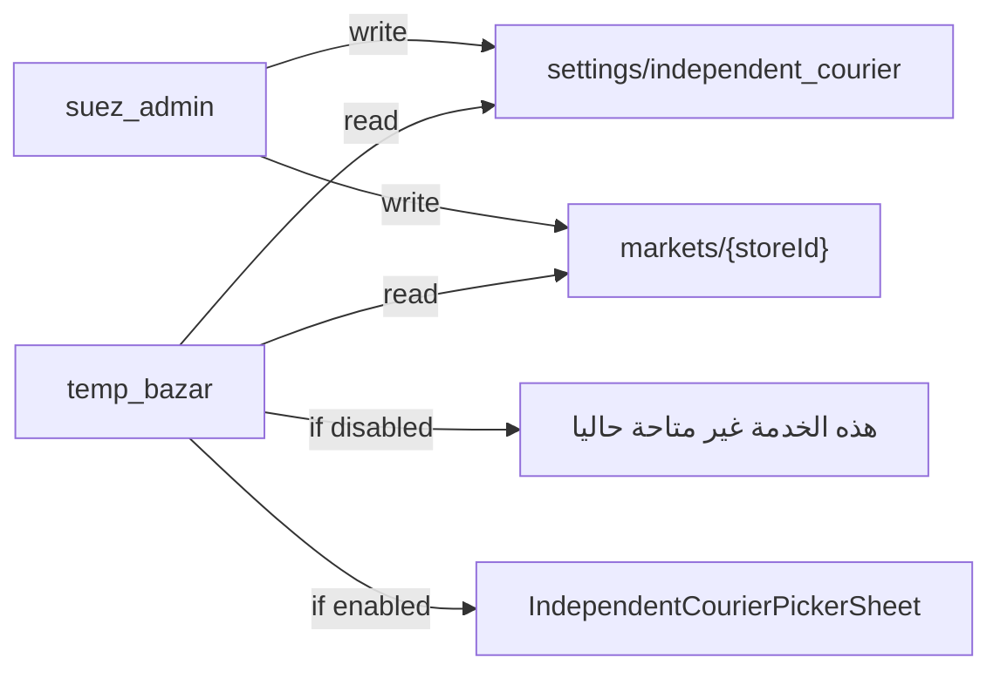

# خطة ربط تحكم الأدmin في ميزة طلب المناديب

## الوضع الحالي

- **تطبيق التاجر** ([`temp_bazar`](d:/project/bazarsuez/bazar_suez/temp_bazar)): زر **"اختيار المناديب"** يفتح `IndependentCourierPickerSheet` من [`MarketOrdersPage.dart`](d:/project/bazarsuez/bazar_suez/temp_bazar/lib/markets/order_of_markets/pages/MarketOrdersPage.dart) (السطور 361–401). لا يوجد أي feature flag للمناديب.
- **تطبيق الأدmin** ([`suez_admin`](D:/project/suezadmin/suez_admin)): يدير تسجيل المناديب (`courier_requests`) ورسوم التوصيل (`settings/delivery_fee`) لكن **لا يوجد** تحكم في تفعيل/إيقاف طلب المناديب.
- **Firebase مشترك**: المشروع `bazar-suez-app` — التغييرات في Firestore تظهر فوراً في التطبيقين.



---

## 1. نموذج البيانات في Firestore

### إعداد عام (Global)

مسار جديد: **`settings/independent_courier`**

```json
{
  "enabled": true,
  "updatedAt": "<serverTimestamp>",
  "updatedBy": "<adminUid>"
}
```

- **`enabled: false`** → الميزة معطّلة لكل المتاجر (ما لم يُستثنَ لاحقاً — غير مطلوب الآن).
- **الافتراضي عند عدم وجود المستند**: `enabled: true` (سلوك متوافق مع الإصدارات الحالية).

### إعداد لكل متجر (Per-store)

حقل جديد على **`markets/{storeId}`**:

```json
{
  "independentCourierEnabled": true | false | null
}
```

- **`null` أو غير موجود** → يرث الإعداد العام.
- **`false`** → معطّل لهذا المتجر حتى لو العام مفعّل.
- **`true`** → مفعّل لهذا المتجر (لكن يظل معطّلاً إذا العام `enabled: false`).

### منطق التفعيل الفعّال

```dart
bool isCourierRequestEnabled({
  required bool globalEnabled,
  required bool? storeOverride,
}) =>
    globalEnabled && (storeOverride ?? true);
```

---

## 2. تطبيق الأدmin (`suez_admin`)

اتباع نفس نمط [`delivery_fee`](D:/project/suezadmin/suez_admin/lib/delivery_fee/services/delivery_fee_service.dart).

### ملفات جديدة

```
lib/courier_settings/
  models/independent_courier_settings.dart   # enabled, fromMap, toMap, defaults()
  services/independent_courier_settings_service.dart  # get/update + cache 5 دقائق
  pages/independent_courier_settings_page.dart        # Switch عام + حفظ
```

### تعديلات على ملفات موجودة

| الملف | التعديل |
|-------|---------|
| [`admin_routes.dart`](D:/project/suezadmin/suez_admin/lib/router/routes_config/admin_routes.dart) | مسار `/admin/courier-settings` |
| [`dashboard_page.dart`](D:/project/suezadmin/suez_admin/lib/dashboard/dashboard_page.dart) | عنصر "إعدادات طلب المناديب" ضمن قسم **المناديب والتوصيل** (بجانب رسوم التوصيل) |
| [`stores_service.dart`](D:/project/suezadmin/suez_admin/lib/stores/services/stores_service.dart) | `updateIndependentCourierEnabled(storeId, bool?)` |
| [`store_model.dart`](D:/project/suezadmin/suez_admin/lib/stores/models/store_model.dart) | حقل `independentCourierEnabled` |
| [`store_commission_page.dart`](D:/project/suezadmin/suez_admin/lib/commission/pages/store_commission_page.dart) | Switch: **تفعيل طلب المناديب لهذا المتجر** (ثلاث حالات: موروث / مفعّل / معطّل) |

### واجهة الأدmin

- **صفحة عامة**: Switch واحد "تفعيل طلب المناديب لجميع المتاجر" + زر حفظ.
- **صفحة المتجر** (عمولة/إعدادات المتجر): Switch أو Segmented control:
  - **موروث من الإعداد العام** (default)
  - **مفعّل**
  - **معطّل**

---

## 3. تطبيق التاجر (`temp_bazar`)

### ملفات جديدة

```
lib/services/independent_courier/
  independent_courier_settings.dart
  independent_courier_settings_service.dart
```

نفس بنية [`delivery_fee_settings.dart`](d:/project/bazarsuez/bazar_suez/temp_bazar/lib/services/delivery_fee/delivery_fee_settings.dart) و [`delivery_fee_service.dart`](d:/project/bazarsuez/bazar_suez/temp_bazar/lib/services/delivery_fee/delivery_fee_service.dart).

دالة مركزية:

```dart
Future<bool> isIndependentCourierEnabledForStore(String marketId)
```

تقرأ الإعداد العام + `markets/{marketId}.independentCourierEnabled`.

### نقاط الحجب (Gate) — عرض الرسالة

الرسالة المطلوبة: **"هذه الخدمة غير متاحة حاليا"** (SnackBar أو AlertDialog — SnackBar أبسط ومتسق مع باقي الصفحة).

| الملف | الدالة/الزر | السلوك |
|-------|-------------|--------|
| [`MarketOrdersPage.dart`](d:/project/bazarsuez/bazar_suez/temp_bazar/lib/markets/order_of_markets/pages/MarketOrdersPage.dart) | `_handleRequestDelivery` | فحص قبل فتح الـ bottom sheet |
| نفس الملف | `_openIndependentCourierPicker` | فحص (يغطي: تغيير مندوب، إعادة إرسال يدوي، اختيار مندوب) |
| نفس الملف | `onAutoRedispatchIndependentCourier` | فحص قبل إعادة الإرسال التلقائي |
| [`independent_courier_dispatch_service.dart`](d:/project/bazarsuez/bazar_suez/temp_bazar/lib/markets/order_of_markets/independent_couriers/services/independent_courier_dispatch_service.dart) | `createOrResendIndependentCourierOrder` | فحص أخير قبل الكتابة على Firestore (طبقة حماية إضافية) |

**ملاحظة:** زر **"اختيار المناديب"** يبقى ظاهراً؛ عند الضغط تظهر الرسالة بدلاً من فتح قائمة المناديب (حسب طلبك).

**الطلبات الجارية:** الطلبات التي لها `dispatchType: independent_courier` بالفعل **لا تُلغى** — الحجب فقط على طلبات/إرسالات جديدة.

### تحميل الإعدادات

في `MarketOrdersPage.initState` أو `MarketOrdersViewModel`: تحميل/الاستماع للإعداد العام + قراءة حقل المتجر مرة واحدة (أو stream على `markets/{marketId}` إذا أردنا تحديث فوري عند تغيير الأدmin).

---

## 4. قواعد Firestore

تحديث [`firestore.rules`](d:/project/bazarsuez/bazar_suez/temp_bazar/firestore.rules):

```javascript
match /settings/{docId} {
  allow read: if true;           // مثل commission_config — للقراءة العامة
  allow write: if isAdmin();
}
```

وإضافة `independentCourierEnabled` إلى قائمة الحقول المسموح للأدmin بتعديلها في `markets/{storeId}` (السطور 112–117).

**نشر القواعد** بعد التعديل: `firebase deploy --only firestore:rules`

---

## 5. ترتيب التنفيذ

1. **Firestore model + rules** — المستند والحقل والصلاحيات
2. **Admin: service + صفحة عامة + route + dashboard**
3. **Admin: toggle لكل متجر** في صفحة عمولة/إعدادات المتجر
4. **Merchant: service + gate في MarketOrdersPage + dispatch service**
5. **اختبار يدوي** على Firebase project مشترك

---

## 6. سينarios الاختبار

| السينario | النتيجة المتوقعة |
|-----------|------------------|
| عام = مفعّل، متجر = موروث | يفتح picker المناديب |
| عام = معطّل | رسالة "هذه الخدمة غير متاحة حاليا" لكل المتاجر |
| عام = مفعّل، متجر = معطّل | رسالة للمتجر المعطّل فقط |
| عام = معطّل، متجر = مفعّل | رسالة (العام يلغي التفعيل الفردي) |
| طلب جاري بمندوب | يستمر بدون تأثر |
| تغيير من الأدmin أثناء فتح التاجر | يُطبَّق عند الضغط التالي (أو فوراً مع stream) |

---

## الملفات المرجعية (أنماط موجودة)

- إعداد عام: [`delivery_fee_service.dart`](D:/project/suezadmin/suez_admin/lib/delivery_fee/services/delivery_fee_service.dart) → `settings/delivery_fee`
- toggle لكل متجر: [`canReceiveOrders`](d:/project/bazarsuez/bazar_suez/temp_bazar/lib/markets/wallet/services/commission_service.dart) على `markets`
- نقطة دخول الميزة: [`OrderActionButtons.dart`](d:/project/bazarsuez/bazar_suez/temp_bazar/lib/markets/order_of_markets/widget/OrderActionButtons.dart) سطر 88 — **"اختيار المناديب"**
