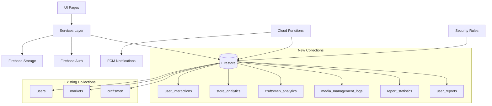
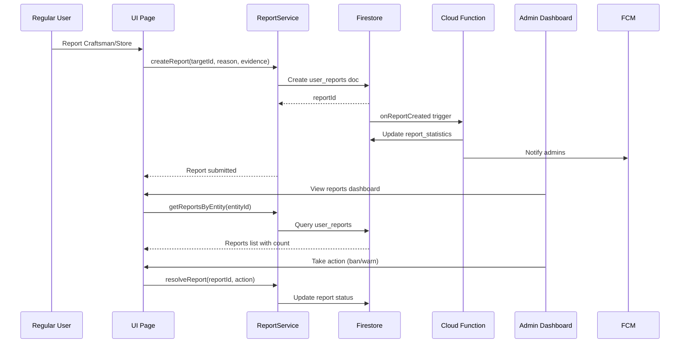

# Design Document: Enhanced Admin Features

## Overview

توسيع نظام الإدارة الحالي في تطبيق Bazaar Suez بميزات متقدمة واحترافية تشمل: نظام إبلاغات متكامل يسمح للمستخدمين بالإبلاغ عن الصنايعية والمتاجر، صفحة إدارة متقدمة للحسابات مع إمكانية الحذف وتحويل الحسابات، صفحة إدارة الصور المرفوعة، وlوحات تحكم (dashboards) منفصلة للصنايعية والمتاجر مع إحصائيات تفصيلية شاملة.

**التقنيات المستخدمة:** Flutter + Firebase (Firestore, Auth, Storage)

**5 Modules رئيسية:**
1. User Reports System - نظام إبلاغات احترافي من المستخدمين
2. Advanced Account Management - إدارة متقدمة للحسابات (حذف، تحويل)
3. Media Management - إدارة الصور المرفوعة
4. Craftsmen Analytics Dashboard - لوحة إحصائيات الصنايعية المتقدمة
5. Stores Analytics Dashboard - لوحة إحصائيات المتاجر المنفصلة

## Architecture



## Main Workflow - User Report System




## Components and Interfaces

### Component 1: UserReportService

**Purpose**: إدارة نظام الإبلاغات من المستخدمين العاديين عن الصنايعية والمتاجر

**Interface**:
```dart
class UserReportService {
  /// إنشاء بلاغ جديد من مستخدم عادي
  Future<String> createReport({
    required String reporterId,
    required String targetEntityId,
    required EntityType targetType, // craftsman, store
    required String reason,
    required ReportCategory category,
    List<String>? evidenceUrls,
    String? additionalDetails,
  });
  
  /// جلب كل البلاغات لكيان معين (صنايعي أو متجر)
  Future<List<UserReport>> getReportsByEntity(String entityId);
  
  /// عدد البلاغات لكيان معين
  Future<int> getReportCount(String entityId);
  
  /// جلب البلاغات المعلقة للأدمن
  Stream<List<UserReport>> watchPendingReports({
    EntityType? filterByType,
    ReportCategory? filterByCategory,
  });
  
  /// حل بلاغ (اتخاذ إجراء)
  Future<void> resolveReport({
    required String reportId,
    required String adminId,
    required ReportResolution resolution,
    String? actionTaken,
  });
  
  /// رفض بلاغ (غير صحيح)
  Future<void> dismissReport({
    required String reportId,
    required String adminId,
    required String reason,
  });
  
  /// جلب إحصائيات البلاغات
  Future<ReportStatistics> getReportStatistics();
}

enum EntityType { craftsman, store }

enum ReportCategory {
  inappropriate_content,    // محتوى غير لائق
  fake_information,        // معلومات مزيفة
  poor_service,           // خدمة سيئة
  fraud,                 // احتيال
  harassment,            // مضايقة
  spam,                 // إزعاج/سبام
  other                 // أخرى
}

enum ReportResolution {
  warning_issued,        // تحذير
  temporary_suspension,  // إيقاف مؤقت
  permanent_ban,        // حظر دائم
  no_action,           // لا إجراء
  account_deleted      // حذف الحساب
}
```

**Responsibilities**:
- التحقق من صحة البلاغات
- منع البلاغات المكررة من نفس المستخدم
- تتبع عدد البلاغات لكل كيان
- إرسال إشعارات للأدمن

### Component 2: AdvancedAccountService

**Purpose**: إدارة متقدمة للحسابات مع إمكانية الحذف والتحويل

**Interface**:
```dart
class AdvancedAccountService {
  /// حذف حساب صنايعي أو متجر نهائياً
  Future<void> deleteAccount({
    required String accountId,
    required EntityType accountType,
    required String adminId,
    required String deletionReason,
  });
  
  /// تحويل حساب صنايعي/متجر إلى مستخدم عادي
  Future<void> convertToRegularUser({
    required String accountId,
    required EntityType currentType,
    required String adminId,
    String? conversionReason,
  });
  
  /// استعادة حساب محذوف (خلال فترة grace period)
  Future<void> restoreAccount({
    required String accountId,
    required EntityType accountType,
  });
  
  /// جلب سجل العمليات على الحساب
  Future<List<AccountAction>> getAccountHistory(String accountId);
  
  /// حذف دفعة من الحسابات
  Future<BatchDeletionResult> batchDeleteAccounts({
    required List<String> accountIds,
    required EntityType accountType,
    required String adminId,
    required String reason,
  });
}
```

**Responsibilities**:
- حذف آمن للحسابات مع تسجيل السبب
- تحويل الحسابات بين الأنواع
- الاحتفاظ بسجل العمليات
- معالجة الحذف الدفعي

### Component 3: MediaManagementService

**Purpose**: إدارة والتحكم في الصور المرفوعة على حسابات الصنايعية

**Interface**:
```dart
class MediaManagementService {
  /// جلب كل الصور لصنايعي معين
  Future<List<MediaItem>> getCraftsmanMedia(String craftsmanId);
  
  /// حذف صورة معينة
  Future<void> deleteMedia({
    required String mediaId,
    required String craftsmanId,
    required String adminId,
    required String deletionReason,
  });
  
  /// حذف عدة صور دفعة واحدة
  Future<void> batchDeleteMedia({
    required List<String> mediaIds,
    required String craftsmanId,
    required String adminId,
    required String reason,
  });
  
  /// تعليق صورة (إخفاء مؤقت)
  Future<void> suspendMedia({
    required String mediaId,
    required String reason,
  });
  
  /// إعادة تفعيل صورة معلقة
  Future<void> unsuspendMedia(String mediaId);
  
  /// جلب الصور المبلغ عنها
  Stream<List<MediaItem>> watchReportedMedia();
  
  /// إحصائيات الصور
  Future<MediaStatistics> getMediaStatistics(String craftsmanId);
}
```

**Responsibilities**:
- إدارة صور الصنايعية
- حذف الصور غير اللائقة
- تتبع الصور المبلغ عنها
- الاحتفاظ بسجل العمليات

### Component 4: CraftsmenAnalyticsService

**Purpose**: إحصائيات تفصيلية لنظام الصنايعية

**Interface**:
```dart
class CraftsmenAnalyticsService {
  /// إحصائيات عامة للصنايعية
  Future<CraftsmenOverviewStats> getOverviewStatistics();
  
  /// إحصائيات حسب المهنة
  Future<Map<String, ProfessionStats>> getStatsByProfession();
  
  /// إحصائيات صنايعي واحد
  Future<CraftsmanDetailedStats> getCraftsmanStatistics(String craftsmanId);
  
  /// تسجيل اتصال (call)
  Future<void> recordPhoneCall({
    required String craftsmanId,
    required String userId,
  });
  
  /// تسجيل رسالة واتساب
  Future<void> recordWhatsAppMessage({
    required String craftsmanId,
    required String userId,
  });
  
  /// جلب أكثر الصنايعية نشاطاً
  Future<List<CraftsmanRanking>> getTopCraftsmen({
    required RankingCriteria criteria,
    int limit = 10,
  });
  
  /// إحصائيات زمنية (نمو عبر الوقت)
  Future<TimeSeriesData> getGrowthStatistics({
    required DateTime startDate,
    required DateTime endDate,
    required TimeGranularity granularity,
  });
}

enum RankingCriteria {
  most_calls,
  most_whatsapp,
  most_views,
  highest_rated,
}

enum TimeGranularity {
  daily,
  weekly,
  monthly,
}
```

**Responsibilities**:
- حساب الإحصائيات الإجمالية
- تتبع التفاعلات (اتصالات، واتساب)
- إحصائيات حسب المهنة
- ترتيب الصنايعية

### Component 5: StoreAnalyticsService

**Purpose**: إحصائيات تفصيلية لنظام المتاجر (منفصل تماماً)

**Interface**:
```dart
class StoreAnalyticsService {
  /// إحصائيات عامة للمتاجر
  Future<StoreOverviewStats> getOverviewStatistics();
  
  /// إحصائيات حسب فئة المتجر
  Future<Map<String, CategoryStats>> getStatsByCategory();
  
  /// إحصائيات متجر واحد
  Future<StoreDetailedStats> getStoreStatistics(String storeId);
  
  /// تسجيل زيارة لمتجر
  Future<void> recordStoreVisit({
    required String storeId,
    required String userId,
  });
  
  /// تسجيل طلب من متجر
  Future<void> recordOrder({
    required String storeId,
    required String userId,
    required double orderValue,
  });
  
  /// جلب أكثر المتاجر نشاطاً
  Future<List<StoreRanking>> getTopStores({
    required StoreRankingCriteria criteria,
    int limit = 10,
  });
  
  /// إحصائيات المبيعات
  Future<SalesStatistics> getSalesStatistics({
    required DateTime startDate,
    required DateTime endDate,
  });
}

enum StoreRankingCriteria {
  most_orders,
  highest_revenue,
  most_visits,
  best_rated,
}
```

**Responsibilities**:
- حساب إحصائيات المتاجر
- تتبع الطلبات والمبيعات
- إحصائيات حسب الفئة
- ترتيب المتاجر


## Data Models

### Model 1: UserReport

**Collection:** `user_reports`

```dart
class UserReport {
  final String id;
  final String reporterId;           // المستخدم المُبلِّغ
  final String targetEntityId;       // الصنايعي/المتجر المُبلَّغ عنه
  final EntityType targetType;       // craftsman أو store
  final ReportCategory category;     // فئة البلاغ
  final String reason;              // سبب البلاغ
  final List<String> evidenceUrls;  // أدلة (صور/فيديو)
  final String? additionalDetails;  // تفاصيل إضافية
  final ReportStatus status;        // pending, reviewed, resolved, dismissed
  final DateTime createdAt;
  final DateTime? reviewedAt;
  final String? reviewedBy;         // adminId
  final ReportResolution? resolution; // الإجراء المتخذ
  final String? actionDetails;      // تفاصيل الإجراء
}

enum ReportStatus {
  pending,      // معلق
  reviewed,     // قيد المراجعة
  resolved,     // تم حله
  dismissed,    // مرفوض/غير صحيح
}
```

**Validation Rules**:
- reporterId يجب أن يكون مستخدم عادي (ليس admin)
- targetEntityId يجب أن يكون موجود في craftsmen أو markets
- reason لا يمكن أن يكون فارغ
- evidenceUrls اختياري لكن مستحسن
- لا يمكن للمستخدم الإبلاغ عن نفس الكيان أكثر من مرة في 24 ساعة

### Model 2: ReportStatistics

**Collection:** `report_statistics`

```dart
class ReportStatistics {
  final String entityId;            // craftsmanId or storeId
  final EntityType entityType;
  final int totalReports;           // إجمالي البلاغات
  final int pendingReports;         // البلاغات المعلقة
  final int resolvedReports;        // البلاغات المحلولة
  final int dismissedReports;       // البلاغات المرفوضة
  final Map<ReportCategory, int> reportsByCategory; // توزيع حسب الفئة
  final DateTime lastReportAt;      // آخر بلاغ
  final int warningsIssued;         // عدد التحذيرات
  final int suspensionsCount;       // عدد الإيقافات
  final DateTime lastUpdated;
}
```

**Validation Rules**:
- totalReports = pendingReports + resolvedReports + dismissedReports
- warningsIssued + suspensionsCount <= resolvedReports
- يتم تحديث تلقائي عند كل بلاغ جديد أو حل بلاغ

### Model 3: AccountAction

**Collection:** `account_actions` (sub-collection تحت accounts)

```dart
class AccountAction {
  final String id;
  final String accountId;
  final EntityType accountType;
  final AccountActionType actionType;
  final String performedBy;         // adminId
  final DateTime performedAt;
  final String reason;
  final Map<String, dynamic>? metadata; // بيانات إضافية
  final bool isReversible;          // هل يمكن التراجع؟
}

enum AccountActionType {
  deleted,              // حذف
  converted_to_user,    // تحويل لمستخدم عادي
  restored,             // استعادة
  suspended,            // إيقاف
  banned,              // حظر
}
```

**Validation Rules**:
- reason مطلوب لكل إجراء
- performedBy يجب أن يكون admin
- deleted accounts لها grace period 30 يوم قبل الحذف النهائي
- converted_to_user غير قابل للتراجع

### Model 4: MediaItem

**Collection:** `craftsmen_media` (sub-collection تحت craftsmen)

```dart
class MediaItem {
  final String id;
  final String craftsmanId;
  final String storageUrl;          // Firebase Storage URL
  final String thumbnailUrl;
  final MediaType mediaType;        // image, video
  final DateTime uploadedAt;
  final MediaStatus status;         // active, suspended, deleted
  final int reportCount;            // عدد البلاغات عن هذه الصورة
  final DateTime? suspendedAt;
  final String? suspendedBy;        // adminId
  final String? suspensionReason;
  final DateTime? deletedAt;
  final String? deletedBy;
  final String? deletionReason;
}

enum MediaType { image, video }

enum MediaStatus {
  active,       // نشط
  suspended,    // معلق
  deleted,      // محذوف
}
```

**Validation Rules**:
- storageUrl يجب أن يكون Firebase Storage URL صحيح
- suspended media لا تظهر للمستخدمين العاديين
- deleted media لا يمكن استعادتها
- reportCount >= 0

### Model 5: CraftsmanDetailedStats

**Collection:** `craftsmen_analytics`

```dart
class CraftsmanDetailedStats {
  final String craftsmanId;
  final String profession;
  
  // إحصائيات التفاعل
  final int totalPhoneCalls;        // إجمالي الاتصالات
  final int totalWhatsAppMessages;  // إجمالي رسائل واتساب
  final int totalViews;             // إجمالي المشاهدات
  final int totalFavorites;         // إجمالي الإضافات للمفضلة
  
  // إحصائيات زمنية
  final int callsLast7Days;
  final int callsLast30Days;
  final int whatsappLast7Days;
  final int whatsappLast30Days;
  
  // تقييمات
  final double averageRating;
  final int totalRatings;
  
  // نشاط
  final DateTime lastActive;
  final DateTime joinedAt;
  final int daysActive;
  
  // ترتيب
  final int rankInProfession;       // ترتيبه في مهنته
  final int rankOverall;            // ترتيبه العام
  
  final DateTime lastUpdated;
}
```

**Validation Rules**:
- كل الأرقام >= 0
- averageRating بين 0 و 5
- callsLast7Days <= callsLast30Days <= totalPhoneCalls
- lastUpdated يتم تحديثه عند كل تفاعل

### Model 6: StoreDetailedStats

**Collection:** `store_analytics`

```dart
class StoreDetailedStats {
  final String storeId;
  final String category;
  
  // إحصائيات الطلبات
  final int totalOrders;
  final int ordersLast7Days;
  final int ordersLast30Days;
  final double totalRevenue;
  final double revenueLast30Days;
  
  // إحصائيات الزوار
  final int totalVisits;
  final int visitsLast7Days;
  final int visitsLast30Days;
  final int uniqueVisitors;
  
  // تقييمات
  final double averageRating;
  final int totalRatings;
  
  // المنتجات
  final int totalProducts;
  final int activeProducts;
  
  // نشاط
  final DateTime lastOrderAt;
  final DateTime joinedAt;
  
  // ترتيب
  final int rankInCategory;
  final int rankOverall;
  
  final DateTime lastUpdated;
}
```

**Validation Rules**:
- totalRevenue >= revenueLast30Days
- totalOrders >= ordersLast30Days >= ordersLast7Days
- activeProducts <= totalProducts
- averageRating بين 0 و 5

### Model 7: UserInteraction

**Collection:** `user_interactions`

```dart
class UserInteraction {
  final String id;
  final String userId;
  final String targetEntityId;      // craftsmanId or storeId
  final EntityType targetType;
  final InteractionType interactionType;
  final DateTime timestamp;
  final Map<String, dynamic>? metadata;
}

enum InteractionType {
  phone_call,
  whatsapp_message,
  profile_view,
  favorite_added,
  store_visit,
  order_placed,
}
```

**Validation Rules**:
- userId يجب أن يكون موجود
- targetEntityId يجب أن يكون موجود
- timestamp لا يمكن أن يكون في المستقبل
- metadata اختياري، يحتوي على بيانات إضافية (مثل order value)


## Algorithmic Pseudocode

### Algorithm 1: Create User Report

```dart
Future<String> createReport({
  required String reporterId,
  required String targetEntityId,
  required EntityType targetType,
  required String reason,
  required ReportCategory category,
  List<String>? evidenceUrls,
  String? additionalDetails,
}) async {
  // Step 1: Validate inputs
  if (reason.isEmpty) {
    throw ValidationException('Reason cannot be empty');
  }
  
  // Step 2: Check for duplicate reports (within 24 hours)
  final existingReports = await _firestore
      .collection('user_reports')
      .where('reporterId', isEqualTo: reporterId)
      .where('targetEntityId', isEqualTo: targetEntityId)
      .where('createdAt', isGreaterThan: DateTime.now().subtract(Duration(hours: 24)))
      .get();
  
  if (existingReports.docs.isNotEmpty) {
    throw DuplicateReportException('You already reported this entity in the last 24 hours');
  }
  
  // Step 3: Verify target entity exists
  final collectionName = targetType == EntityType.craftsman ? 'craftsmen' : 'markets';
  final entityDoc = await _firestore.collection(collectionName).doc(targetEntityId).get();
  
  if (!entityDoc.exists) {
    throw EntityNotFoundException('Target entity not found');
  }
  
  // Step 4: Create report document
  final reportDoc = _firestore.collection('user_reports').doc();
  final reportData = {
    'reporterId': reporterId,
    'targetEntityId': targetEntityId,
    'targetType': targetType.toString(),
    'category': category.toString(),
    'reason': reason,
    'evidenceUrls': evidenceUrls ?? [],
    'additionalDetails': additionalDetails,
    'status': ReportStatus.pending.toString(),
    'createdAt': FieldValue.serverTimestamp(),
    'reviewedAt': null,
    'reviewedBy': null,
    'resolution': null,
    'actionDetails': null,
  };
  
  await reportDoc.set(reportData);
  
  // Step 5: Update statistics (this will trigger Cloud Function)
  // Cloud Function will handle updating report_statistics collection
  
  return reportDoc.id;
}
```

**Preconditions:**
- reporterId is a valid user ID
- targetEntityId exists in craftsmen or markets collection
- reason is not empty
- User hasn't reported the same entity in the last 24 hours

**Postconditions:**
- New report document created in user_reports collection
- Report status is pending
- Cloud Function triggered to update statistics
- Admin notification sent

**Loop Invariants:** N/A (no loops)

### Algorithm 2: Delete Account Permanently

```dart
Future<void> deleteAccount({
  required String accountId,
  required EntityType accountType,
  required String adminId,
  required String deletionReason,
}) async {
  // Step 1: Validate admin permissions
  final adminDoc = await _auth.currentUser?.getIdTokenResult();
  if (adminDoc?.claims?['role'] != 'admin') {
    throw UnauthorizedException('Only admins can delete accounts');
  }
  
  // Step 2: Get account document
  final collectionName = accountType == EntityType.craftsman ? 'craftsmen' : 'markets';
  final accountRef = _firestore.collection(collectionName).doc(accountId);
  final accountDoc = await accountRef.get();
  
  if (!accountDoc.exists) {
    throw EntityNotFoundException('Account not found');
  }
  
  // Step 3: Use batch for atomic operations
  final batch = _firestore.batch();
  
  // Step 3a: Mark account as deleted (soft delete with grace period)
  batch.update(accountRef, {
    'adminStatus': 'deleted',
    'deletedAt': FieldValue.serverTimestamp(),
    'deletedBy': adminId,
    'deletionReason': deletionReason,
    'gracePeriodEnds': DateTime.now().add(Duration(days: 30)),
  });
  
  // Step 3b: Log the action
  final actionRef = accountRef.collection('account_actions').doc();
  batch.set(actionRef, {
    'accountId': accountId,
    'accountType': accountType.toString(),
    'actionType': AccountActionType.deleted.toString(),
    'performedBy': adminId,
    'performedAt': FieldValue.serverTimestamp(),
    'reason': deletionReason,
    'isReversible': true,
    'metadata': {'gracePeriodDays': 30},
  });
  
  // Step 3c: Update user auth (disable account)
  // This will be done separately as it's not part of Firestore batch
  
  // Step 4: Commit batch
  await batch.commit();
  
  // Step 5: Disable Firebase Auth account
  // Note: This requires Admin SDK, typically done via Cloud Function
  await _callCloudFunction('disableUserAccount', {
    'uid': accountId,
    'reason': deletionReason,
  });
  
  // Step 6: Schedule permanent deletion after grace period
  // Cloud Function will handle this with scheduled task
}
```

**Preconditions:**
- adminId has admin role
- accountId exists in the appropriate collection
- deletionReason is not empty

**Postconditions:**
- Account marked as deleted in Firestore
- Firebase Auth account disabled
- Account action logged
- Grace period of 30 days set for restoration
- Cloud Function scheduled to permanently delete after grace period

**Loop Invariants:** N/A (no loops)

### Algorithm 3: Convert Account to Regular User

```dart
Future<void> convertToRegularUser({
  required String accountId,
  required EntityType currentType,
  required String adminId,
  String? conversionReason,
}) async {
  // Step 1: Validate admin permissions
  final adminDoc = await _auth.currentUser?.getIdTokenResult();
  if (adminDoc?.claims?['role'] != 'admin') {
    throw UnauthorizedException('Only admins can convert accounts');
  }
  
  // Step 2: Get current account data
  final collectionName = currentType == EntityType.craftsman ? 'craftsmen' : 'markets';
  final accountRef = _firestore.collection(collectionName).doc(accountId);
  final accountDoc = await accountRef.get();
  
  if (!accountDoc.exists) {
    throw EntityNotFoundException('Account not found');
  }
  
  final accountData = accountDoc.data()!;
  
  // Step 3: Extract basic user info
  final basicUserData = {
    'uid': accountId,
    'name': accountData['name'],
    'email': accountData['email'],
    'phone': accountData['phone'],
    'userType': 'regular',
    'convertedFrom': currentType.toString(),
    'convertedAt': FieldValue.serverTimestamp(),
    'convertedBy': adminId,
    'conversionReason': conversionReason,
  };
  
  // Step 4: Use batch for atomic operations
  final batch = _firestore.batch();
  
  // Step 4a: Create regular user document
  final userRef = _firestore.collection('users').doc(accountId);
  batch.set(userRef, basicUserData);
  
  // Step 4b: Archive old account data
  final archiveRef = _firestore
      .collection('archived_accounts')
      .doc('${currentType.toString()}_$accountId');
  batch.set(archiveRef, {
    ...accountData,
    'archivedAt': FieldValue.serverTimestamp(),
    'archivedBy': adminId,
    'reason': conversionReason,
  });
  
  // Step 4c: Delete original account
  batch.delete(accountRef);
  
  // Step 4d: Log the action
  final actionRef = userRef.collection('account_actions').doc();
  batch.set(actionRef, {
    'accountId': accountId,
    'accountType': currentType.toString(),
    'actionType': AccountActionType.converted_to_user.toString(),
    'performedBy': adminId,
    'performedAt': FieldValue.serverTimestamp(),
    'reason': conversionReason ?? 'Converted to regular user',
    'isReversible': false,
    'metadata': {'originalType': currentType.toString()},
  });
  
  // Step 5: Commit batch
  await batch.commit();
  
  // Step 6: Update Firebase Auth custom claims
  await _callCloudFunction('updateUserClaims', {
    'uid': accountId,
    'claims': {'userType': 'regular'},
  });
}
```

**Preconditions:**
- adminId has admin role
- accountId exists in craftsmen or markets collection
- Account is not already deleted or suspended

**Postconditions:**
- New user document created in users collection
- Original account archived in archived_accounts
- Original account deleted from craftsmen/markets
- Firebase Auth custom claims updated
- Action logged in account_actions
- Operation is irreversible

**Loop Invariants:** N/A (no loops)

### Algorithm 4: Calculate Craftsmen Statistics

```dart
Future<CraftsmenOverviewStats> calculateCraftsmenStats() async {
  // Step 1: Get all craftsmen
  final craftsmenSnapshot = await _firestore.collection('craftsmen').get();
  final totalCraftsmen = craftsmenSnapshot.docs.length;
  
  // Step 2: Count by status
  int activeCraftsmen = 0;
  int pendingCraftsmen = 0;
  int suspendedCraftsmen = 0;
  
  final professionCounts = <String, int>{};
  
  for (final doc in craftsmenSnapshot.docs) {
    final data = doc.data();
    final status = data['adminStatus'] ?? 'pending';
    final profession = data['profession'] ?? 'other';
    
    // Count by status
    if (status == 'approved') activeCraftsmen++;
    else if (status == 'pending') pendingCraftsmen++;
    else if (status == 'suspended') suspendedCraftsmen++;
    
    // Count by profession
    professionCounts[profession] = (professionCounts[profession] ?? 0) + 1;
  }
  
  // Step 3: Calculate interaction statistics
  final now = DateTime.now();
  final last30Days = now.subtract(Duration(days: 30));
  
  final interactionsSnapshot = await _firestore
      .collection('user_interactions')
      .where('targetType', isEqualTo: 'craftsman')
      .where('timestamp', isGreaterThan: last30Days)
      .get();
  
  int totalCalls = 0;
  int totalWhatsApp = 0;
  
  for (final doc in interactionsSnapshot.docs) {
    final type = doc.data()['interactionType'];
    if (type == 'phone_call') totalCalls++;
    else if (type == 'whatsapp_message') totalWhatsApp++;
  }
  
  // Step 4: Find top performers
  final analyticsSnapshot = await _firestore
      .collection('craftsmen_analytics')
      .orderBy('totalPhoneCalls', descending: true)
      .limit(10)
      .get();
  
  final topCraftsmen = analyticsSnapshot.docs
      .map((doc) => doc.data()['craftsmanId'] as String)
      .toList();
  
  // Step 5: Return aggregated statistics
  return CraftsmenOverviewStats(
    total: totalCraftsmen,
    active: activeCraftsmen,
    pending: pendingCraftsmen,
    suspended: suspendedCraftsmen,
    byProfession: professionCounts,
    totalCallsLast30Days: totalCalls,
    totalWhatsAppLast30Days: totalWhatsApp,
    topPerformers: topCraftsmen,
    lastUpdated: DateTime.now(),
  );
}
```

**Preconditions:**
- User has admin permissions
- Collections exist and are readable

**Postconditions:**
- Complete statistics object returned
- All counts are accurate as of execution time
- Statistics are not cached (real-time calculation)

**Loop Invariants:**
- For each craftsman processed: totalCraftsmen count remains consistent
- For each interaction processed: totalCalls + totalWhatsApp increases monotonically
- professionCounts total = totalCraftsmen


## Key Functions with Formal Specifications

### Function 1: recordPhoneCall()

```dart
Future<void> recordPhoneCall({
  required String craftsmanId,
  required String userId,
}) async
```

**Preconditions:**
- `craftsmanId` exists in craftsmen collection
- `userId` exists in users collection
- User has made an actual call (client-side verification)

**Postconditions:**
- New interaction document created in user_interactions
- craftsmen_analytics document updated with incremented totalPhoneCalls
- callsLast7Days and callsLast30Days updated if applicable
- timestamp is current server time

**Loop Invariants:** N/A

### Function 2: batchDeleteMedia()

```dart
Future<void> batchDeleteMedia({
  required List<String> mediaIds,
  required String craftsmanId,
  required String adminId,
  required String reason,
}) async
```

**Preconditions:**
- All mediaIds exist in craftsmen_media sub-collection
- adminId has admin role
- reason is not empty
- All media items belong to the specified craftsmanId

**Postconditions:**
- All specified media items marked as deleted
- Storage files deleted from Firebase Storage
- media_management_logs updated for each deletion
- deletedAt, deletedBy, and deletionReason set for each item

**Loop Invariants:**
- For each mediaId processed: number of successfully deleted items increases
- All processed items belong to craftsmanId
- Batch operation is atomic (all succeed or all fail)

### Function 3: getReportCount()

```dart
Future<int> getReportCount(String entityId) async
```

**Preconditions:**
- entityId is a valid craftsman or store ID

**Postconditions:**
- Returns non-negative integer
- Count includes all reports (pending, resolved, dismissed)
- Result is accurate as of query time

**Loop Invariants:** N/A

### Function 4: resolveReport()

```dart
Future<void> resolveReport({
  required String reportId,
  required String adminId,
  required ReportResolution resolution,
  String? actionTaken,
}) async
```

**Preconditions:**
- reportId exists in user_reports collection
- Report status is pending
- adminId has admin or moderator role
- resolution is a valid ReportResolution enum value

**Postconditions:**
- Report status changed to resolved
- reviewedAt set to current timestamp
- reviewedBy set to adminId
- resolution and actionTaken fields populated
- report_statistics updated for target entity

**Loop Invariants:** N/A

## Example Usage

### Example 1: User Creates Report

```dart
// User reports a craftsman for inappropriate content
final reportService = UserReportService();

try {
  final reportId = await reportService.createReport(
    reporterId: 'user123',
    targetEntityId: 'craftsman456',
    targetType: EntityType.craftsman,
    reason: 'الصور المرفوعة غير لائقة وتحتوي على محتوى مسيء',
    category: ReportCategory.inappropriate_content,
    evidenceUrls: [
      'https://storage.example.com/evidence1.jpg',
      'https://storage.example.com/evidence2.jpg',
    ],
  );
  
  print('Report created successfully: $reportId');
  // Admin will be notified automatically via Cloud Function
} on DuplicateReportException catch (e) {
  print('Error: $e');
  // Show user message: "You already reported this person recently"
} catch (e) {
  print('Error creating report: $e');
}
```

### Example 2: Admin Deletes Account

```dart
// Admin deletes a craftsman account
final accountService = AdvancedAccountService();

try {
  await accountService.deleteAccount(
    accountId: 'craftsman789',
    accountType: EntityType.craftsman,
    adminId: 'admin001',
    deletionReason: 'Multiple violations of community guidelines',
  );
  
  print('Account deleted successfully. Grace period: 30 days.');
  // User has 30 days to appeal before permanent deletion
} on UnauthorizedException catch (e) {
  print('Permission denied: $e');
} catch (e) {
  print('Error deleting account: $e');
}
```

### Example 3: Admin Converts Store to Regular User

```dart
// Admin converts a store to regular user account
final accountService = AdvancedAccountService();

try {
  await accountService.convertToRegularUser(
    accountId: 'store456',
    currentType: EntityType.store,
    adminId: 'admin001',
    conversionReason: 'Store owner requested account downgrade',
  );
  
  print('Store converted to regular user successfully');
  // Original store data is archived
  // User now has regular account with basic info only
} catch (e) {
  print('Error converting account: $e');
}
```

### Example 4: Admin Manages Media

```dart
// Admin deletes inappropriate images
final mediaService = MediaManagementService();

// Get all media for a craftsman
final mediaItems = await mediaService.getCraftsmanMedia('craftsman123');

// Filter reported media
final reportedMedia = mediaItems.where((m) => m.reportCount > 0).toList();

// Delete specific inappropriate images
if (reportedMedia.isNotEmpty) {
  await mediaService.batchDeleteMedia(
    mediaIds: reportedMedia.map((m) => m.id).toList(),
    craftsmanId: 'craftsman123',
    adminId: 'admin001',
    reason: 'Images violate community guidelines',
  );
  
  print('Deleted ${reportedMedia.length} inappropriate images');
}
```

### Example 5: View Craftsmen Analytics Dashboard

```dart
// Admin views craftsmen analytics
final analyticsService = CraftsmenAnalyticsService();

// Get overview statistics
final overviewStats = await analyticsService.getOverviewStatistics();

print('Total Craftsmen: ${overviewStats.total}');
print('Active: ${overviewStats.active}');
print('Pending: ${overviewStats.pending}');
print('Calls (Last 30 Days): ${overviewStats.totalCallsLast30Days}');
print('WhatsApp (Last 30 Days): ${overviewStats.totalWhatsAppLast30Days}');

// Get statistics by profession
final professionStats = await analyticsService.getStatsByProfession();

professionStats.forEach((profession, stats) {
  print('\n$profession:');
  print('  Count: ${stats.count}');
  print('  Total Calls: ${stats.totalCalls}');
  print('  Avg Rating: ${stats.averageRating}');
});

// Get top performers
final topCraftsmen = await analyticsService.getTopCraftsmen(
  criteria: RankingCriteria.most_calls,
  limit: 10,
);

print('\nTop 10 Craftsmen by Calls:');
topCraftsmen.forEach((ranking) {
  print('${ranking.rank}. ${ranking.name} - ${ranking.value} calls');
});
```

### Example 6: View Stores Analytics Dashboard

```dart
// Admin views stores analytics (separate from craftsmen)
final storeAnalyticsService = StoreAnalyticsService();

// Get overview statistics
final storeStats = await storeAnalyticsService.getOverviewStatistics();

print('Total Stores: ${storeStats.total}');
print('Active: ${storeStats.active}');
print('Total Orders (Last 30 Days): ${storeStats.ordersLast30Days}');
print('Total Revenue: \$${storeStats.totalRevenue}');

// Get statistics by category
final categoryStats = await storeAnalyticsService.getStatsByCategory();

categoryStats.forEach((category, stats) {
  print('\n$category:');
  print('  Stores: ${stats.count}');
  print('  Total Orders: ${stats.totalOrders}');
  print('  Revenue: \$${stats.totalRevenue}');
});

// Get top stores
final topStores = await storeAnalyticsService.getTopStores(
  criteria: StoreRankingCriteria.highest_revenue,
  limit: 10,
);

print('\nTop 10 Stores by Revenue:');
topStores.forEach((ranking) {
  print('${ranking.rank}. ${ranking.name} - \$${ranking.value}');
});
```

### Example 7: Record User Interactions

```dart
// Record phone call when user taps "Call" button
await CraftsmenAnalyticsService().recordPhoneCall(
  craftsmanId: 'craftsman123',
  userId: 'user456',
);

// Record WhatsApp message when user taps "WhatsApp" button
await CraftsmenAnalyticsService().recordWhatsAppMessage(
  craftsmanId: 'craftsman123',
  userId: 'user456',
);

// Record store visit when user views store page
await StoreAnalyticsService().recordStoreVisit(
  storeId: 'store789',
  userId: 'user456',
);

// Record order when user places an order
await StoreAnalyticsService().recordOrder(
  storeId: 'store789',
  userId: 'user456',
  orderValue: 250.0,
);
```

## Correctness Properties

### Property 1: Report Uniqueness

```dart
∀ report1, report2 ∈ user_reports:
  (report1.reporterId = report2.reporterId ∧ 
   report1.targetEntityId = report2.targetEntityId ∧
   |report1.createdAt - report2.createdAt| < 24 hours) ⟹ 
  report1.id = report2.id
```

**Meaning:** المستخدم لا يمكنه الإبلاغ عن نفس الكيان أكثر من مرة في 24 ساعة

### Property 2: Statistics Consistency

```dart
∀ entity ∈ (craftsmen ∪ markets):
  entity.reportStatistics.totalReports = 
    count(user_reports WHERE targetEntityId = entity.id)
```

**Meaning:** إحصائيات البلاغات يجب أن تتطابق مع العدد الفعلي للبلاغات

### Property 3: Media Deletion Integrity

```dart
∀ media ∈ craftsmen_media:
  media.status = deleted ⟹ 
  (media.deletedAt ≠ null ∧ 
   media.deletedBy ≠ null ∧ 
   media.deletionReason ≠ "" ∧
   storageFileExists(media.storageUrl) = false)
```

**Meaning:** كل صورة محذوفة يجب أن يكون لها تاريخ حذف، من حذفها، سبب الحذف، والملف محذوف من Storage

### Property 4: Account Conversion Irreversibility

```dart
∀ action ∈ account_actions:
  action.actionType = converted_to_user ⟹ 
  (action.isReversible = false ∧
   ¬∃ originalAccount ∈ (craftsmen ∪ markets) 
     WHERE originalAccount.id = action.accountId)
```

**Meaning:** تحويل الحساب لمستخدم عادي غير قابل للتراجع والحساب الأصلي لا يعود موجوداً

### Property 5: Analytics Accuracy

```dart
∀ craftsman ∈ craftsmen_analytics:
  craftsman.totalPhoneCalls = 
    count(user_interactions WHERE 
      targetEntityId = craftsman.id ∧ 
      interactionType = phone_call)
```

**Meaning:** عدد الاتصالات في Analytics يجب أن يساوي عدد التفاعلات الفعلية

### Property 6: Grace Period Enforcement

```dart
∀ account ∈ (craftsmen ∪ markets):
  (account.adminStatus = deleted ∧ 
   now() < account.gracePeriodEnds) ⟹ 
  accountCanBeRestored(account.id) = true
```

**Meaning:** الحسابات المحذوفة يمكن استعادتها خلال فترة السماح

